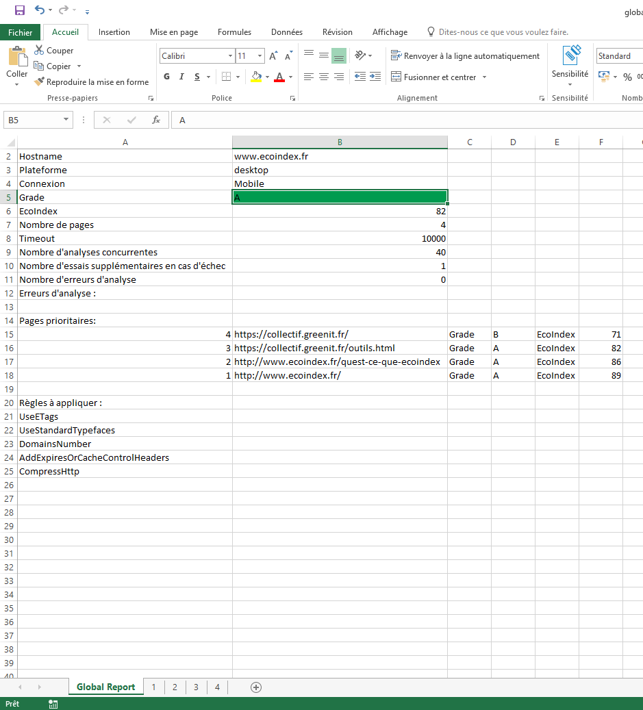
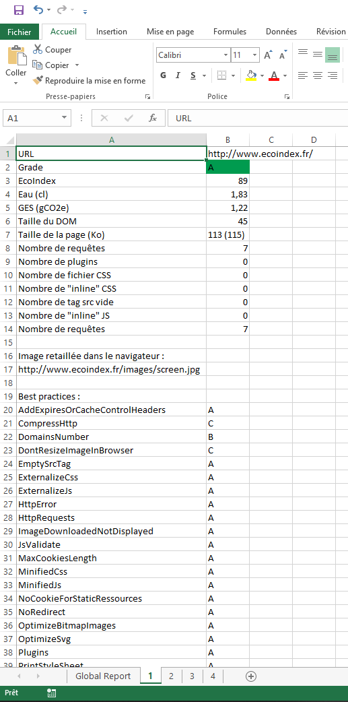
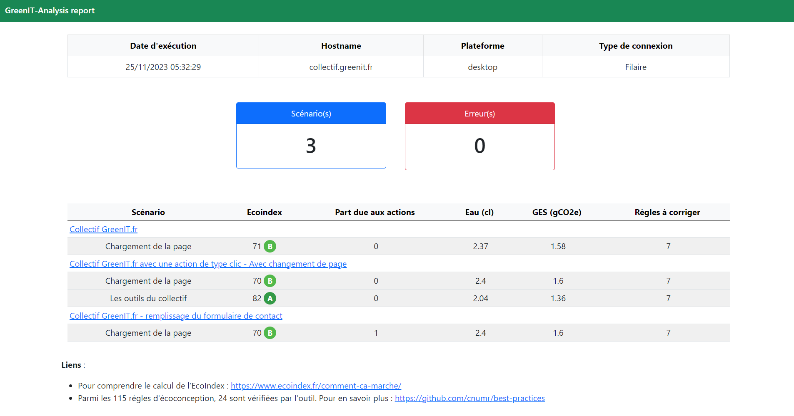
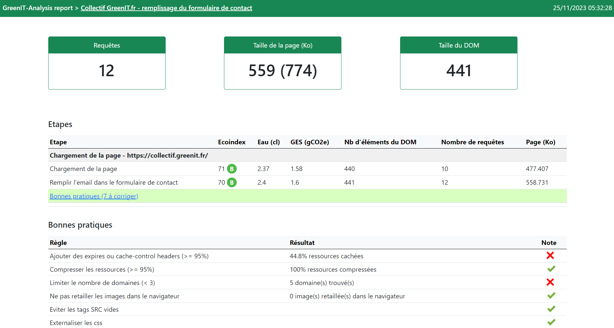

# GreenIT-Analysis 
Cette application est basée sur l'extension Chrome GreenIT-Analysis (https://github.com/cnumr/GreenIT-Analysis).

# Sommaire
- [Principe de l'outil](#principe-de-loutil)
- [Pour commencer](#pour-commencer)
  - [Node.js](#nodejs)
    - [Prérequis](#prérequis)
    - [Installation](#installation)
  - [Docker](#docker)
    - [Prérequis](#prérequis-1)
    - [Utilisation](#utilisation)
    - [Configurer un proxy](#configurer-un-proxy)
- [Usage](#usage)
  - [Analyse](#analyse)
    - [Construction du fichier d'entrée](#construction-du-fichier-dentrée)
    - [Commande](#commande)
    - [Usage avec Docker](#usage-avec-docker)
    - [Formats des rapports](#formats-des-rapports)
  - [ParseSiteMap](#parsesitemap)
  - [Flags généraux](#flags-généraux)
- [Conditions d'utilisation](#conditions-dutilisation)

# Principe de l'outil
Cet outil simule l'exécution de l'extension sur les pages spécifiées ouvertes dans Chromium en passant par Puppeteer pour récuperer les résultats. 

Le système de cache est désactivé pour fiabiliser l'analyse d'une page.

Selon les pages à analyser, il peut être nécessaire de mettre en place une condition afin d'attendre la fin du chargement de la page (voir le paragraphe [Construction du fichier d'entrée](#construction-du-fichier-dentrée) de l'analyse).

# Pour commencer

Pour utiliser l'outil, il faut au préalable vérifier les prérequis et réaliser les étapes d'installation.

Pour cela, deux manières différentes de pouvoir l'utiliser :
- Soit en passant par une installation manuelle de Node.js
- Soit en passant par Docker

## Node.js

### Prérequis
 - Node.js

### Installation 
1. Récupérer le code source : 
```
git clone https://github.com/cnumr/GreenIT-Analysis-cli.git
```
2. Installer les packages NPM :
```
npm install
```
3. Créer le lien symbolique pour faciliter l'usage de l'outil : 
```
npm link
```

## Docker

### Prérequis
 - Docker

### Installation

1. Créer le dossier `/<path>/input` qui vous permettra de mettre à disposition le fichier `<url_input_file>` au conteneur :
 ```
 mkdir -p /<path>/input
 ```
2. Autoriser tous les utilisateurs à lire dans le dossier `/<path>/input` :
 ```
 chmod 755 /<path>/input
 ```
3. Créer le dossier `/<path>/output` qui vous permettra de récupérer les rapports générés par le conteneur :
 ```
 mkdir -p /<path>/output
 ```
4. Autoriser tous les utilisateurs à écrire dans le dossier `/<path>/output` :
 ```
 chmod 777 /<path>/output
 ```
5. Récupérer le code source : 
 ```
 git clone https://github.com/cnumr/GreenIT-Analysis-cli.git
 ```
6. Construire l'image Docker : 
 ```
 docker build -t imageName .
 ```

### Configurer un proxy
Si vous avez besoin de configurer un proxy, il faut :

1. Modifier le Dockerfile 

```
# Uncomment if you need to configure proxy. 
# You can init these variables by using --build-arg during docker build
# Example : docker build [...] --build-arg http_proxy=http://<user>:<password>@<host>:<port>
ENV HTTP_PROXY=$http_proxy
ENV HTTPS_PROXY=$https_proxy
ENV NO_PROXY=$no_proxy

[...]

# Uncomment if you need to configure proxy. 
#RUN npm config set proxy $HTTP_PROXY 
```

2. Construire l'image en passant les informations du proxy en paramètres

Exemple :
```
docker build -t imageName \
  --build-arg http_proxy=http://<user>:<password>@<host>:<port> \
  --build-arg https_proxy=https://<user>:<password>@<host>:<port> \
  --build-arg no_proxy=<no_proxy> \
  .
```

# Usage

## Analyse

### Construction du fichier d'entrée

Construire le fichier `<url_input_file>` qui liste les URL à analyser. Le fichier est au format YAML.

Sa structure est la suivante :

| Paramètre           | Type   | Obligatoire | Description                                                         |
| ------------------- | ------ | ----------- | ------------------------------------------------------------------- |
| `url`               | string | Oui         | URL de la page à analyser                                           |
| `name`              | string | Non         | Nom de la page à analyser affiché dans le rapport                   |
| `waitForSelector`   | string | Non         | Attend que l'élément HTML définit par le sélecteur CSS soit visible |
| `waitForXPath`      | string | Non         | Attend que l'élément HTML définit par le XPath soit visible         |
| `waitForNavigation` | string | Non         | Attend la fin du chargement de la page. 4 valeurs possibles : `load`, `domcontentloaded`, `networkidle0`, `networkidle2` |
| `screenshot`        | string | Non         | Réalise une capture d'écran de la page à analyser. La valeur à renseigner est le nom de la capture d'écran. La capture d'écran est réalisée même si le chargement de la page est en erreur. |
| `actions`           | list   | Non         | Réalise une suite d'actions avant d'analyser la page                |

#### Conditions d'attente
Le paramètre `waitForNavigation` exploite les fonctionnalités de Puppeteer pour détecter la fin de chargement d'une page sans passer par un sélecteur CSS ou un XPath :
- `load` : considère que la navigation est terminée lorsque l'événement `load` est déclenché.
- `domcontentloaded` : considère que la navigation est terminée lorsque l'événement `DOMContentLoaded` est déclenché.
- `networkidle0` : considère que la navigation est terminée lorsqu'il n'y a pas plus de 0 connexion réseau pendant au moins 500 ms.
- `networkidle2` : considère que la navigation est terminée lorsqu'il n'y a pas plus de 2 connexions réseau pendant au moins 500 ms.

Plus de détails ici : https://github.com/puppeteer/puppeteer/blob/main/docs/api.md

Par défaut, si aucun des paramètres de type `waitFor` n'est défini, alors l'outil considère que la navigation est terminée lorsque l'événement `load` est déclenché.

Exemple de fichier `url.yaml` : 
```yaml
# Analyse l'URL collectif.greenit.fr 
- name : 'Collectif GreenIT.fr'
  url : 'https://collectif.greenit.fr/'

# Analyse l'URL collectif.greenit.fr/outils.html en spécifiant une condition d'attente via un sélecteur CSS
# Réalise une capture d'écran de la page
- name : 'Les outils du collectif GreenIT.fr'
  url : 'https://collectif.greenit.fr/outils.html'
  waitForSelector: '#header'
  screenshot: 'screenshots/outils.png'

# Analyse l'URL collectif.greenit.fr/index_en.html en spécifiant une condition d'attente via un XPath
- url : 'https://collectif.greenit.fr/index_en.html'
  waitForXPath: '//section[2]/div/h2'
```

#### Actions
Les actions permettent de définir un parcours utilisateur plus complexe avant de lancer l'analyse. 

Il est possible de définir une liste d'actions à travers le champ `actions` qui est de type liste. La forme d'une action est la suivante :

| Paramètre           | Type   | Obligatoire | Description                                                                 |
| ------------------- | ------ | ----------- | --------------------------------------------------------------------------- |
| `name`              | string | Non         | Non de l'action                                                             |
| `type`              | string | Oui         | Type de l'action : `click`, `scroll`, `select`, `text`                      |
| `element`           | string | Non         | Element du DOM sur lequel l'action doit être exécutée. De type CSS selector |
| `timeoutBefore`     | string | Non         | Temps d'arrêt avant d'exécuter l'action (en millisecondes)                  |
| `waitForSelector`   | string | Non         | Attend que l'élément HTML définit par le sélecteur CSS soit visible         |
| `waitForXPath`      | string | Non         | Attend que l'élément HTML définit par le XPath soit visible                 |
| `waitForNavigation` | string | Non         | Attend la fin du chargement de la page. 4 valeurs possibles : `load`, `domcontentloaded`, `networkidle0`, `networkidle2` |

Les conditions de type `waitFor` peuvent être réutilisées afin de définir une condition d'attente après l'exécution de l'action. Elles restent optionnelles.

Des paramètres supplémentaires peuvent être nécessaires selon le type de l'action.

##### click
Ce type d'action permet de simuler un clic sur un élément de la page.

Ce type d'action nécessite les paramètres supplémentaires :

| Paramètre | Type   | Obligatoire | Description                                                         |
| --------- | ------ | ----------- | ------------------------------------------------------------------- |
| `element` | string | Oui         | Element du DOM sur lequel le clic est réalisé. De type CSS selector |

Exemple :
```yaml
- name : 'Collectif GreenIT.fr écoindex'
  url : 'https://collectif.greenit.fr/'
  actions:
    - name : 'Clic sur Découvrez nos outils'
      type: 'click'
      element : 'a[title="Nos outils"]'
      timeoutBefore: 1000
      waitForSelector: '#header'
```

##### scroll
Ce type d'action permet de simuler un utilisateur qui scroll vers le bas de la page.

Ce type d'action n'a pas de paramètre supplémentaire.

Exemple :
```yaml
- name : 'ecoconceptionweb.com'
  url : 'https://ecoconceptionweb.com/'
  actions:
    - name : "Scroll auto vers le bas de la page"
      type : 'scroll'
```

##### select
Ce type d'action permet de simuler la sélection d'une ou plusieurs valeurs dans une liste déroulante.

Ce type d'action nécessite les paramètres supplémentaires :

| Paramètre | Type   | Obligatoire | Description                                                           |
| --------- | ------ | ----------- | --------------------------------------------------------------------- |
| `element` | string | Oui         | Element du DOM représentant la liste déroulante. De type CSS selector |
| `values`  | list   | Oui         | Liste des valeurs à sélectionner                                      |

Exemple :
```yaml
- name : 'ecoconceptionweb.com'
  url : 'https://ecoconceptionweb.com/'
  actions:
    - name : "Saisie du choix Proposer dans le select Sujet"
      type : 'select'
      element : '#subject'
      values: ['proposer']
```

##### text
Ce type d'action permet de simuler la saisie d'un texte dans un champ d'un formulaire par exemple.

Ce type d'action nécessite les paramètres supplémentaires :

| Paramètre | Type   | Obligatoire | Description                                                         |
| --------- | ------ | ----------- | ------------------------------------------------------------------- |
| `element` | string | Oui         | Element du DOM dans lequel le texte est saisi. De type CSS selector |
| `content` | string | Oui         | Contenu du texte à saisir                                           |

Exemple :
```yaml
- name : 'Collectif GreenIT.fr écoindex'
  url : 'https://collectif.greenit.fr/'
  actions:
    - name : 'Remplir l'email dans le formulaire de contact'
      type : 'text'
      element: '#form_email'
      content: 'john.doe@mail.com'
      timeoutBefore: 1000
```

### Commande 

```
greenit analyse <url_input_file> <report_output_file>
```

Paramètres obligatoires :
- `url_input_file` : Chemin vers le fichier YAML listant toutes les URL à analyser. (Valeur par défaut : "url.yaml")
- `report_output_file` : Chemin pour le fichier de sortie. (Valeur par défaut : "results.xlsx")

Paramètres optionnels :
- `--timeout , -t` : Nombre de millisecondes maximal pour charger une url. (Valeur par défaut : 180000)
- `--max_tab` : Nombre d'URL analysées en "simultané" (asynchronicité). (Valeur par défaut : 40)
- `--retry , -r` : Nombre d'essais supplémentaires d'analyse en cas d'echec. (Valeur par défaut : 2)
- `--worst_pages` : Nombre de pages à traiter en priorité affichées sur la page de résumé. (Valeur par défaut : 5)
- `--worst_rules` : Nombre de règles à respecter en priorité affichées sur la page de résumé. (Valeur par défaut : 5)
- `--login , -l` : Chemin vers le fichier YAML contenant les informations de connexions.

  Exemple de login.yaml :
  ```yaml
  url: "https://url/login"
  fields:
    - selector: '#usernameFieldId'
      value: username
    - selector: '#passwordFieldId'
      value: password
  loginButtonSelector: '#loginButtonId'
  ```
  Plus d'informations sur les selectors : https://developer.mozilla.org/en-US/docs/Web/CSS/CSS_Selectors

- `--device , -d` : Emulation du terminal d'affichage. (Valeur par défaut : "desktop")
  
  Choix :
  - desktop
  - galaxyS9
  - galaxyS20
  - iPhone8
  - iPhone8Plus
  - iPhoneX
  - iPad

- `--proxy , -p` : Chemin vers le fichier YAML contenant les informations de configuration du proxy.

  Exemple de proxy.yaml :
  ```yaml
  server: "<host>:<port>"
  user: "<username>"
  password: "<password>"
  ```

- `--format , -f` : Format du rapport. (Valeur par défaut : "xlsx")

Choix :
- xlsx 
- html

- `--headers , -h` : Chemin vers le fichier YAML contenant les headers HTTP configurés pour accéder aux URL à analyser.

  Exemple de headers.yaml :
  ```yaml
  accept: 'text/html,application/xhtml+xml,application/xml'
  accept-encoding: 'gzip, deflate, br'
  accept-language: 'en-US,en;q=0.9,en;q=0.8'
  ```

### Usage avec Docker
1. Déposer le fichier `<url_input_file>` dans le dossier `/<path>/input`.
2. Lancer l'analyse :
```
docker run -it --init --rm --cap-add=SYS_ADMIN \
  -v /<path>/input:/app/input \
  -v /<path>/output:/app/output  \
  -e TZ=<timezone> \
  --name containerName \
  imageName
```

Remarque : il faut définir la variable d'environnement `TZ` pour définir votre timezone afin d'afficher correctement les dates dans les rapports. Exemple de timezone : `TZ=Europe/Paris`.

3. Récupérer les résultats dans votre dossier `/<path>/output`

#### Redéfinir les variables `URL_PATH` et `RESULTS_PATH` 
Vous pouvez redéfinir les variables `URL_PATH` et `RESULTS_PATH` si vous souhaitez changer le nom des fichiers ou leur emplacement.

Exemple :
```
docker run -it --init --rm --cap-add=SYS_ADMIN \
  -v /<path>/input:/app/input \
  -v /<path>/output:/app/output  \
  -e TZ=<timezone> \
  -e "URL_PATH=/app/input/myapp_url.yaml" \
  -e "RESULTS_PATH=/app/output/results_20210101.xlsx" \
  --name containerName \
  imageName
```

#### Surcharger l'instruction CMD définie dans le Dockerfile 
Vous pouvez surcharger la commande renseignée par défaut dans le Dockerfile.

Exemple : 
```
docker run -it --init --rm --cap-add=SYS_ADMIN \
  -v /<path>/input:/app/input \
  -v /<path>/output:/app/output  \
  -e TZ=<timezone> \
  --name containerName \
  imageName \
  greenit analyse /app/input/url.yaml /app/output/results.xlsx --max_tab=1 --timeout=15000 --retry=5
```

#### Lancer l'analyse avec la configuration d'un proxy
Vous pouvez déposer le fichier `proxy.yaml` dans le dossier `/<path>/input` et lancer le conteneur :
```
docker run -it --init --rm --cap-add=SYS_ADMIN \
  -v /<path>/input:/app/input \
  -v /<path>/output:/app/output  \
  -e TZ=<timezone> \
  --name containerName \
  imageName \
  greenit analyse /app/input/url.yaml /app/output/results.xlsx --proxy=/app/input/proxy.yaml
```

### Formats des rapports

#### Excel (xlsx)

Prérequis : le fichier de sortie doit avoir l'extension `.xlsx`.

Exemple de commande : 

```
greenit analyse /app/input/url.yaml /app/output/results.xlsx --format=xlsx
```

Le rapport Excel est composé :
- D'un onglet représentant le rapport global : moyenne de l'ecoindex de toutes les URL analysées, les URL prioritaires à corriger, les règles prioritaires à corriger, ...
- D'un onglet par URL analysée : l'ecoindex de l'URL et ses indicateurs ayant servi à le calculer, les indicateurs de consommation d'eau et d'émissions de gaz à effet de serre, le tableau des bonnes pratiques, ...

Exemple d'un rapport :
- Onglet global :



- Onglet pour une URL analysée :



#### HTML

Prérequis : 
- le fichier de sortie doit avoir l'extension `.html`
- le paramètre `--format=html` ou `-f=html` doit être utilisé 

Exemple de commande : 

```
greenit analyse /app/input/url.yaml /app/output/global.html --format=html
```

Le rapport HTML est composé :
- D'une page résumé : moyenne de l'ecoindex de toutes les pages analysées, nombre total de règles à corriger, tableau de toutes les pages analysées avec leurs indicateurs associés (ecoindex, eau, GES, nombre de règles à corriger) et les règles prioritaires à corriger. Pour accéder au rapport détaillé d'une URL analysée, il suffit de cliquer sur le nom de la page.
- D'une page par URL analysée  : l'ecoindex de l'URL et ses indicateurs ayant servi à le calculer, les indicateurs de consommation d'eau et d'émissions de gaz à effet de serre, le tableau des bonnes pratiques, ...

Exemple d'un rapport :
- Page globale :



- Page pour une URL analysée :



## ParseSiteMap

```
greenit parseSitemap <sitemap_url> <yaml_output_file>
```

Paramètres obligatoires :
- `sitemap_url` : URL de la sitemap à transformer.
- `yaml_output_file` : Chemin pour le fichier de sortie. (Valeur par défaut : "url.yaml")

## Flags généraux

- `--ci` : Log de façon traditionnelle pour assurer la compatibilité avec les environements CI.

# Conditions d'utilisation

Cet outil fait appel à une API ne permettant pas son utilisation à des fins commerciales.
