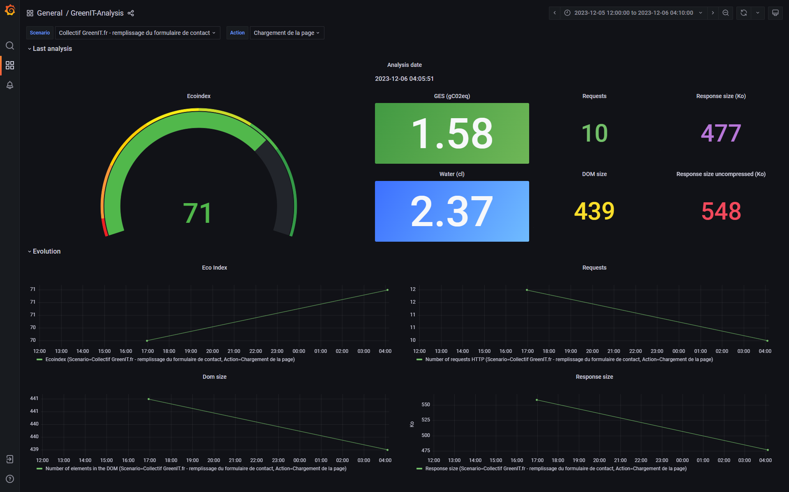

[Version française](./README.md)

# GreenIT-Analysis-cli

This tool is based on the GreenIT-Analysis Chrome extension (https://github.com/cnumr/GreenIT-Analysis).

# Summary
- [Principle of the tool](#principle-of-the-tool)
- [To start](#to-start)
  - [Node.js](#nodejs)
    - [Prerequisites](#prerequisites)
    - [Installation](#installation)
  - [Docker](#docker)
    - [Prerequisites](#prerequisites-1)
    - [First solution: pull the docker image](#first-solution-pull-the-docker-image)
    - [Second solution: build the docker image](#second-solution-build-the-docker-image)
- [Usage](#usage)
  - [Analysis](#analysis)
    - [Construction of the input file](#construction-of-the-input-file)
      - [Waiting conditions](#waiting-conditions)
      - [Actions](#actions)
        - [click](#click)
        - [scroll](#scroll)
        - [select](#select)
        - [text](#text)
    - [Command](#command)
    - [Use with Docker](#use-with-docker)
    - [Report formats](#report-formats)
      - [Excel (xlsx)](#excel-xlsx)
      - [HTML](#html)
      - [InfluxDB/Grafana](#influxdbgrafana)
      - [InfluxDB/Grafana + HTML](#influxdbgrafana--html)
  - [ParseSiteMap](#parsesitemap)
  - [General flags](#general-flags)
- [Terms of use](#terms-of-use)

# Principle of the tool

This tool simulates running the extension on specified pages opened in Chromium through Puppeteer to retrieve the results.

The cache system is deactivated to make the analysis of a page more reliable.

Depending on the pages to be analyzed, it may be necessary to set up a condition to wait for the page to finish loading (see the paragraph [Construction of the input file](#construction-of-the-input-file) of analysis).

# To start

To use the tool, you must first check the prerequisites and complete the installation steps.

Two different ways to use it :
- Either through a manual installation of Node.js
- Either through Docker

## Node.js

### Prerequisites
 - Node.js

### Installation
1. Get the source code:
```
git clone https://github.com/cnumr/GreenIT-Analysis-cli.git
```
2. Position yourself in the GreenIT-Analysis-cli directory :
 ```
 cd GreenIT-Analysis-cli
 ```
3. Install NPM packages :
```
npm install
```
4. Create the symbolic link to facilitate the use of the tool :
```
npm link
```

## Docker

There are two solutions to use the tool with Docker:
- Pull the docker image from Docker Hub
- Build the docker image

### Prerequisites
 - Docker

Also, please perform the following actions that will be required when using the tool:

1. Create the `/<path>/input` folder which will allow you to make the `<url_input_file>` file available to the container :
 ```
 mkdir -p /<path>/input
 ```
2. Allow all users to read in the `/<path>/input` folder :
 ```
 chmod 755 /<path>/input
 ```
3. Create the `/<path>/output` folder which will allow you to retrieve the reports generated by the container :
 ```
 mkdir -p /<path>/output
 ```
4. Allow all users to write to the `/<path>/output` folder :
 ```
 chmod 777 /<path>/output
 ```

### First solution: pull the docker image

Docker images are pushed into this registry: https://hub.docker.com/repository/docker/jpreisner/greenit-analysis-cli/

To push the latest version of the docker image, you have to execute this command:
 ```
docker pull jpreisner/greenit-analysis-cli:latest
 ```

### Second solution: build the docker image

1. Get the source code :
 ```
 git clone https://github.com/cnumr/GreenIT-Analysis-cli.git
 ```
2. Position yourself in the GreenIT-Analysis-cli directory :
 ```
 cd GreenIT-Analysis-cli
 ```
3. Build the Docker image :
 ```
 docker build -t greenit-analysis-cli .
 ```
 ⚠️ If you are on MacOS, you must run the command with the option `--platform=linux/amd64` :
 ```
 docker build --platform=linux/amd64 -t greenit-analysis-cli .
 ```

Also, if you need to configure a proxy, you must:

1. Edit the Dockerfile

```
# Uncomment if you need to configure the proxy.
# You can init these variables by using --build-arg during the docker build
# Example : docker build [...] --build-arg http_proxy=http://<user>:<password>@<host>:<port>
ENV HTTP_PROXY=$http_proxy
ENV HTTPS_PROXY=$https_proxy
ENV NO_PROXY=$no_proxy

[...]

# Uncomment if you need to configure the proxy.
#RUN npm config set proxy $HTTP_PROXY
```

2. Build the image by passing proxy information as parameters

Example :

```
docker build -t greenit-analysis-cli \
  --build-arg http_proxy=http://<user>:<password>@<host>:<port> \
  --build-arg https_proxy=https://<user>:<password>@<host>:<port> \
  --build-arg no_proxy=<no_proxy> \
  .
```

# Usage

## Analysis

### Construction of the input file

Construct the file `<url_input_file>` which lists the URLs to analyze. The file is in YAML format.

Sa structure est la suivante :

| Parameter           | Type   | Mandatory   | Description                                                          |
| ------------------- | ------ | ----------- | -------------------------------------------------------------------- |
| `url`               | string | Yes         | URL of the page to analyze                                           |
| `name`              | string | No          | Name of the page to analyze displayed in the report                  |
| `waitForSelector`   | string | No          | Waits for the HTML element defined by the CSS selector to be visible |
| `waitForXPath`      | string | No          | Waits for the HTML element defined by the CSS selector to be visible |
| `waitForNavigation` | string | No          | Waits for the page to finish loading. 4 possible values: `load`, `domcontentloaded`, `networkidle0`, `networkidle2`                                                                                      |
| `waitForTimeout`    | int    | No          | Wait X ms, X being equal to the value of the parameter               |
| `screenshot`        | string | No          | Takes a screenshot of the page to analyze. The value to enter is the name of the screenshot. The screenshot is taken even if the page loads in error.                                                |
| `actions`           | list   | No          | Perform a series of actions before analyzing the page                |

#### Waiting conditions
The `waitForNavigation` parameter uses Puppeteer features to detect the end of loading a page without using a CSS selector or an XPath :
- `load` : considers navigation to be complete when the `load` event is triggered.
- `domcontentloaded` : considers navigation to be complete when the `DOMContentLoaded` event is triggered.
- `networkidle0` : considers browsing to be complete when there are no more than 0 network connections for at least 500 ms.
- `networkidle2` : considers browsing to be complete when there are no more than 2 network connections for at least 500 ms.

More details here: https://github.com/puppeteer/puppeteer/blob/main/docs/api/index.md

By default, if none of the `waitFor` type parameters are defined, then the tool considers that navigation is complete when the `load` event is triggered.

Example of `url.yaml` file :

```yaml
# Analyzes the URL collective.greenit.fr
- name : "GreenIT.fr collective"
  url : "https://collectif.greenit.fr/"

# Parses the URL collective.greenit.fr/outil.html by specifying a wait condition via a CSS selector
# Take a screenshot of the page
- name : "The tools of the GreenIT.fr collective"
  url : "https://collectif.greenit.fr/outils.html"
  waitForSelector: "#header"
  screenshot: "output/screenshots/outils.png"

# Parses the URL collective.greenit.fr/index_en.html by specifying a wait condition via an XPath
- url : "https://collectif.greenit.fr/index_en.html"
  waitForXPath: "//section[2]/div/h2"
```

#### Actions
Actions allow you to define a more complex user journey before launching the analysis.

It is possible to define a list of actions through the `actions` field which is of a list type. The form of an action is as follows :

| Parameter           | Type   | Mandatory | Description                                                                 |
| ------------------- | ------ | --------- | --------------------------------------------------------------------------- |
| `name`              | string | No        | No action                                                                   |
| `type`              | string | Yes       | Action type: `click`, `press`, `scroll`, `select`, `text`                            |
| `element`           | string | No        | Element of the DOM on which the action must be executed. CSS selector type  |
| `pageChange`        | boolean | No       | If `true`, indicates that the action triggers a page change. Allows you to have a calculation of indicators dedicated to the new page. Default value: `false`. |
| `timeoutBefore`     | string | No        | Time to stop before executing the action (in milliseconds). Default value: 1000 |
| `waitForSelector`   | string | No        | Waits for the HTML element defined by the CSS selector to be visible        |
| `waitForXPath`      | string | No        | Waits for the HTML element defined by the XPath to be visible               |
| `waitForNavigation` | string | No        | Waits for the page to finish loading. 4 possible values: `load`, `domcontentloaded`, `networkidle0`, `networkidle2`                                                                       |
| `waitForTimeout`    | int    | No        | Wait X ms, X being equal to the value of the parameter               |
| `screenshot`       | string | No         | Take a screenshot of the page, after performing the action. The value to enter is the name of the screenshot. The screenshot is taken even if the action is in error.                                   |

Conditions of type `waitFor` can be reused to define a wait condition after the execution of the action. They remain optional. The screenshot, if applicable, is taken after this wait condition.

Additional parameters may be necessary depending on the type of action.

##### click
This type of action allows you to simulate a click on an element on the page.

This type of action requires the additional parameters:

| Parameter | Type   | Mandatory | Description                                                         |
| --------- | ------ | ----------| ------------------------------------------------------------------- |
| `element` | string | Yes       | Element of the DOM on which the click is made. CSS selector type |

Example :
```yaml
- name : "GreenIT.fr collective ecoindex"
  url : "https://collectif.greenit.fr/"
  actions:
    - name : "Click on Discover our tools"
      type: "click"
      element : "a[title="Nos outils"]"
      timeoutBefore: 1000
      waitForSelector: "#header"
```

##### press
This type of action allows you to simulate a user pressing a key on their keyboard.

This type of action requires the additional parameters:

| Parameter | Type   | Mandatory | Description                                                         |
| --------- | ------ | --------- | ------------------------------------------------------------------- |
| `key`     | string | Yes       | Key on a keyboard. The value must be recognized by Puppeteer.       |

Exemple :
```yaml
- name : 'GreenIT.fr collective ecoindex'
  url : 'https://collectif.greenit.fr/'
  actions:
    - name : 'Press the Enter key'
      type: 'press'
      key : 'Enter'
      waitForTimeout: '1500'
```

##### scroll
This type of action allows you to simulate a user scrolling to the bottom of the page.

This type of action has no additional parameters.

Example :

```yaml
- name : "ecoconceptionweb.com"
  url : "https://ecoconceptionweb.com/"
  actions:
    - name : "Auto scroll to bottom of page"
      type : 'scroll'
```

##### select
This type of action allows you to simulate the selection of one or more values in a drop-down list.

This type of action requires the additional parameters :

| Parameter | Type   | Mandatory | Description                                                           |
| --------- | ------ | ----------- | --------------------------------------------------------------------- |
| `element` | string | Yes         | DOM element representing the drop-down list. CSS selector type |
| `values`  | list   | Oui         | List of values to select                                      |

Example :
```yaml
- name : "ecoconceptionweb.com"
  url : "https://ecoconceptionweb.com/"
  actions:
    - name : "Entering the Suggest choice in the Subject select"
      type : "select"
      element : "#subject"
      values: ["proposer"]
```

##### text
This type of action allows you to simulate the entry of text in a field of a form, for example.

This type of action requires the additional parameters:

| Parameter | Type   | Mandatory | Description                                                         |
| --------- | ------ | ----------- | ------------------------------------------------------------------- |
| `element` | string | Yes         | Element of the DOM in which the text is entered. CSS selector type |
| `content` | string | Yes         | Content of the text to enter                                           |

Example :
```yaml
- name : "GreenIT.fr collective ecoindex"
  url : "https://collectif.greenit.fr/"
  actions:
    - name : "Fill in the email in the contact form"
      type : "text"
      element: "#form_email"
      content: "john.doe@mail.com"
      timeoutBefore: 1000
```

### Command

```
greenit analyse <url_input_file> <report_output_file>
```

Mandatory parameters :
- `url_input_file` : Path to the YAML file listing all the URLs to analyze. (Default value: "url.yaml")
- `report_output_file` : Path to the output file. (Default value: "results.xlsx")

Optional settings :
- `--grafana_link` : Grafana dashboard link to display in the HTML report when the format chosen is `influxdbhtml`. Example: `http://localhost:3000/d/YoK0Xjb4k/greenit-analysis?orgId=1`.
- `--device , -d` : Display terminal emulation. (Default value: "desktop")

  Choice :
  - desktop
  - galaxyS9
  - galaxyS20
  - iPhone8
  - iPhone8Plus
  - iPhoneX
  - iPad

- `--format , -f` : Report format. This parameter is optional: if it is not defined, then the format will be deduced based on the extension of the report file. When set, the format parameter takes precedence over the extension.

Choice :
- xlsx
- html
- influxdb
- influxdbhtml

- `--headers , -h` : Path to the YAML file containing the HTTP headers configured to access the URLs to analyze.

  Example of headers.yaml :

  ```yaml
  accept: "text/html,application/xhtml+xml,application/xml"
  accept-encoding: "gzip, deflate, br"
  accept-language: "en-US,en;q=0.9,en;q=0.8"
  ```

- `--headless` : Setting to enable or disable headless mode. When this mode is deactivated, it allows you to view the automation of actions in the browser. Possible values: [`true`, `false`]. Default value: `true`.
- `--influxdb` : Enables writing of data to an influxdb database
- `--influxdb_hostname` : URL of the influxdb database
- `--influxdb_org` : Organization name influxdb
- `--influxdb_token` : Connection token for influxdb
- `--influxdb_bucket` : Influxdb bucket to send data to
- `--language` : Language used in the report. (Default: fr. Allowed: fr, en)
- `--login , -l` : Path to the YAML file containing the connection information.

  Example of login.yaml :
  ```yaml
  url: "https://url/login"
  fields:
    - selector: "#usernameFieldId"
      value: username
    - selector: "#passwordFieldId"
      value: password
  loginButtonSelector: "#loginButtonId"
  waitForTimeout: 2000
  ```

  More information on selectors: https://developer.mozilla.org/en-US/docs/Web/CSS/CSS_Selectors

- `--max_tab` : Number of URLs analyzed “simultaneously” (asynchronicity). (Default value: 40)
- `--mobile`: Connection type. (Default: wired)
- `--proxy , -p` : Path to the YAML file containing proxy configuration information.

  Proxy.yaml example :

  ```yaml
  server: "<host>:<port>"
  user: "<username>"
  password: "<password>"
  ```

- `--retry , -r` : Number of additional analysis attempts in case of failure. (Default value: 2)
- `--timeout , -t` : Maximum number of milliseconds to load a url. (Default value: 180000)
- `--worst_pages` : Number of pages to be prioritized displayed on the summary page. (Default value: 5)
- `--worst_rules` : Number of priority rules to be respected displayed on the summary page. (Default value: 5)

### Use with Docker
1. Drop the `<url_input_file>` file into the `/<path>/input` folder.
2. Start the analysis:
```
docker run -it --init --rm --cap-add=SYS_ADMIN \
  -v /<path>/input:/app/input \
  -v /<path>/output:/app/output  \
  -e TZ=<timezone> \
  --name GreenIT-Analysis \
  greenit-analysis-cli
```

📝 Note: You must set the environment variable `TZ` to define your timezone in order to correctly display dates in reports. Example of timezone: `TZ=Europe/Paris`.

💡 Tip: in order to view the screenshots taken by the tool, you can either save them in the `/app/output` folder and thus benefit from the existing mount point, or create a mount point dedicated to screenshots.

3. Get the results in your `/<path>/output` folder

#### Redefine the `URL_PATH` and `RESULTS_PATH` variables
You can redefine the `URL_PATH` and `RESULTS_PATH` variables if you want to change the file names or their locations.

Example :
```
docker run -it --init --rm --cap-add=SYS_ADMIN \
  -v /<path>/input:/app/input \
  -v /<path>/output:/app/output  \
  -e TZ=<timezone> \
  -e "URL_PATH=/app/input/myapp_url.yaml" \
  -e "RESULTS_PATH=/app/output/results_20210101.xlsx" \
  --name GreenIT-Analysis \
  greenit-analysis-cli
```

#### Override CMD instruction defined in Dockerfile
You can override the command entered by default in the Dockerfile.

Example :
```
docker run -it --init --rm --cap-add=SYS_ADMIN \
  -v /<path>/input:/app/input \
  -v /<path>/output:/app/output  \
  -e TZ=<timezone> \
  --name GreenIT-Analysis \
  greenit-analysis-cli \
  greenit analyse /app/input/url.yaml /app/output/results.xlsx --max_tab=1 --timeout=15000 --retry=5
```

#### Start scanning with proxy configuration
You can drop the `proxy.yaml` file in the `/<path>/input` folder and launch the container:

```
docker run -it --init --rm --cap-add=SYS_ADMIN \
  -v /<path>/input:/app/input \
  -v /<path>/output:/app/output  \
  -e TZ=<timezone> \
  --name GreenIT-Analysis \
  greenit-analysis-cli \
  greenit analyse /app/input/url.yaml /app/output/results.xlsx --proxy=/app/input/proxy.yaml
```

### Report formats

#### Excel (xlsx)

Prerequisites:
- Either the following parameter is defined: `--format=xlsx` or `-f=xlsx`
- Either the output file must have the extension `.xlsx`

Example:

```
greenit analyse /app/input/url.yaml /app/output/results.xlsx --format=xlsx
```

The Excel report is composed of:
- A tab representing the overall report: average of the ecoindex of all URLs analyzed, priority URLs to correct, priority rules to correct, etc.
- A tab per URL analyzed: the ecoindex of the URL and its indicators used to calculate it, the indicators of water consumption and greenhouse gas emissions, the table of good practices, . ..

Example of a report:
- Global tab:


- Tab for an analyzed URL :


#### HTML

Prerequisites:

- Either the following parameter is defined: `--format=html` or `-f=html`
- Either the output file must have the extension `.html`

Example:

```
greenit analyse /app/input/url.yaml /app/output/global.html --format=html
```

The HTML report is composed:

- One page summary: number of scenarios analyzed, number of errors, summary table of the scenarios analyzed with their associated indicators (ecoindex, water, GHG, number of best practices to be implemented). A scenario begins with the opening of a web page via its URL, then performs a certain number of actions which could possibly lead to the opening of another page. To access the detailed report of an analyzed scenario, simply click on the scenario name. A summary table of best practices not respected (in at least 1 scenario) is also present.
- One page per scenario analyzed: total number of HTTP requests, size and weight of the pages analyzed, as well as a table detailing page by page, and action by action, indicators such as the ecoindex and its indicators used to calculate it, the indicators of water consumption and greenhouse gas emissions, the table of good best practices, etc.

Example of a report:
- Global page:


- Page for a parsed URL:


#### InfluxDB/Grafana

Prerequisites:

- The following parameter is defined: `--format=influxdb` or `-f=influxdb`

The data will be sent to influxdb.

A `docker-compose.yml` with an example configuration of influxdb and grafana is present in the project.
When using for the first time, a few setup steps are necessary:

- Change the username/password pairs in the .env file (optional);
- Start the influxdb container: `docker-compose up greenit-cli-influxdb`;
- Connect to influxdb (`http://localhost:8086` by default) to retrieve the organization id (in the url after connecting `http://localhost:8086/orgs/<org id> `) and the connection-token (data -> API Token), and fill in the corresponding environment variables;
- It is then possible to start the grafana container and send the data to influxdb.

These steps will not be necessary again. However, it will be necessary to restart at least the influxdb container before a test.

Example of use :

```shell
greenit analyse exampleUrl.yaml --format=influxdb --influxdb_hostname http://localhost:8086 --influxdb_org organisation --influxdb_token token --influxdb_bucket db0
```

Example of a grafana dashboard for a scenario and an action:


#### InfluxDB/Grafana + HTML

Prerequisites:

- The following parameter is defined: `--format=influxdbhtml` or `-f=influxdbhtml`

This parameter allows you to send the data to InfluxDB, view it in Grafana, and generate an HTML report.

The particularity of this option is found in the generated HTML report: an additional column is displayed in the overall page to consult the evolution over time of the indicators of a page by redirecting to the Grafana board.

```shell
greenit analyse exampleUrl.yaml --format=influxdb --influxdb_hostname http://localhost:8086 --influxdb_org organization --influxdb_token token --influxdb_bucket db0
```

Global page of the HTML report generated with the `influxdbhtml` option:


## ParseSiteMap

```
greenit parseSitemap <sitemap_url> <yaml_output_file>
```

Mandatory parameters:
- `sitemap_url`: URL of the sitemap to transform.
- `yaml_output_file`: Path to the output file. (Default value: "url.yaml")

## General flags

- `--ci`: Log in the traditional way to ensure compatibility with CI environments.

# Terms of use

This tool uses an API that does not allow its use for commercial purposes.
